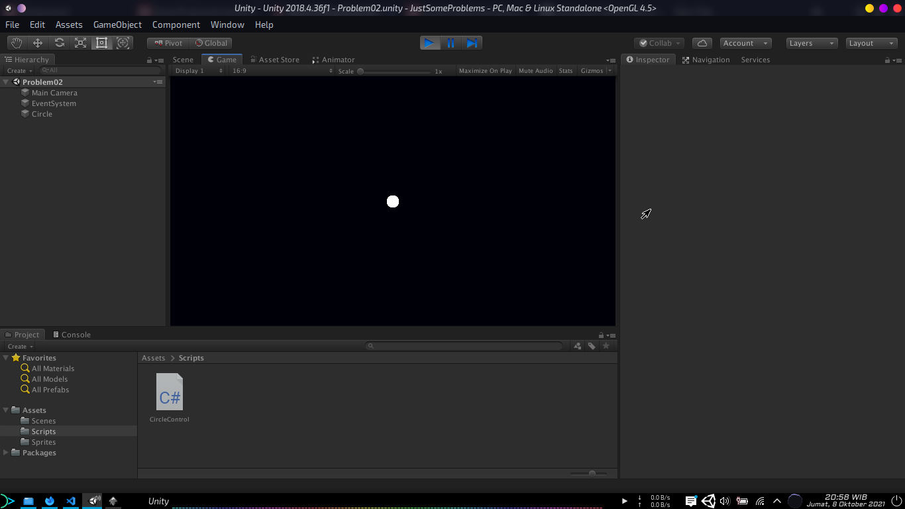
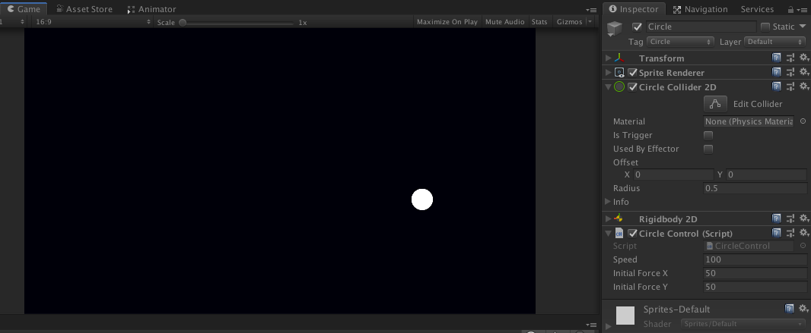
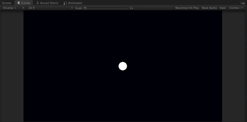
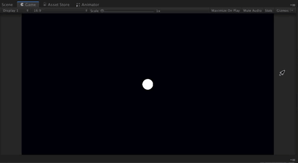
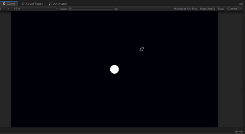

# Problematic
### *Problem Solving assignment from Agate Academy*

## Problem 1
  
Hanya sebuah lingkaran di tengah layar...

## Problem 2
  
... sekarang lingkarannya bergerak ke arah acak. Kecepatan konstan dengan vektor gerak yang di-*normalize*.

## Problem 3
  
Tambah dinding di sekeliling layar. Lingkaran akan memantul kalo nabrak.

## Problem 4
  
Gerakkan lingkaran dengan tombol arah.

## problem 5
  
Lingkaran bergerak mengikuti letak touch kursor (atau klik maksudnya).
